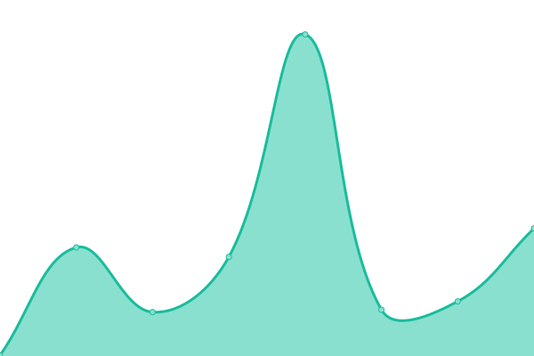

# [📈 Live Status](https://up.tuxtechlab.com): <!--live status--> **🟧 Partial outage**

This repository contains the open-source uptime monitor and status page for [TuxTechLab](https://up.tuxtechlab.com), powered by [Upptime](https://upptime.js.org).

With [Upptime](https://upptime.js.org), you can get your own unlimited and free uptime monitor and status page, powered entirely by a GitHub repository. We use [Issues](https://github.com/TuxTechLab/up/issues) as incident reports, [Actions](https://github.com/TuxTechLab/up/actions) as uptime monitors, and [Pages](https://up.tuxtechlab.com) for the status page.

<!--start: status pages-->
<!-- This summary is generated by Upptime (https://github.com/upptime/upptime) -->
<!-- Do not edit this manually, your changes will be overwritten -->
<!-- prettier-ignore -->
| URL | Status | History | Response Time | Uptime |
| --- | ------ | ------- | ------------- | ------ |
|  [Google](https://www.google.com) | 🟩 Up | [google.yml](https://github.com/TuxTechLab/up/commits/HEAD/history/google.yml) | 

 81ms
     
 | 

<a href="https://up.tuxtechlab.com/history/google">100.00%</a>
    

|  [GitHub](https://www.github.com) | 🟩 Up | [git-hub.yml](https://github.com/TuxTechLab/up/commits/HEAD/history/git-hub.yml) | 

 242ms
     
 | 

<a href="https://up.tuxtechlab.com/history/git-hub">100.00%</a>
    

|  [GoDaddy](https://www.godaddy.com/en-in) | 🟥 Down | [go-daddy.yml](https://github.com/TuxTechLab/up/commits/HEAD/history/go-daddy.yml) | 

 238ms
     
 | 

<a href="https://up.tuxtechlab.com/history/go-daddy">0.00%</a>
    

|  [LinkTree](https://linktr.ee) | 🟩 Up | [link-tree.yml](https://github.com/TuxTechLab/up/commits/HEAD/history/link-tree.yml) | 

 93ms
     
 | 

<a href="https://up.tuxtechlab.com/history/link-tree">100.00%</a>
    

|  [LinkTree Admin Dashboard](https://linktr.ee/arindamtanti) | 🟩 Up | [link-tree-admin-dashboard.yml](https://github.com/TuxTechLab/up/commits/HEAD/history/link-tree-admin-dashboard.yml) | 

 11ms
     
 | 

<a href="https://up.tuxtechlab.com/history/link-tree-admin-dashboard">100.00%</a>
    

|  [TuxTechLab Home](https://www.TuxTechLab.com) | 🟥 Down | [tux-tech-lab-home.yml](https://github.com/TuxTechLab/up/commits/HEAD/history/tux-tech-lab-home.yml) | 

 0ms
     
 | 

<a href="https://up.tuxtechlab.com/history/tux-tech-lab-home">0.00%</a>
    

|  [TuxTechBlog](https://blogs.tuxtechlab.com) | 🟩 Up | [tux-tech-blog.yml](https://github.com/TuxTechLab/up/commits/HEAD/history/tux-tech-blog.yml) | 

 188ms
     
 | 

<a href="https://up.tuxtechlab.com/history/tux-tech-blog">100.00%</a>
    

|  [Test Broken Site](https://thissitedoesnotexist.koj.co) | 🟥 Down | [test-broken-site.yml](https://github.com/TuxTechLab/up/commits/HEAD/history/test-broken-site.yml) | 

 0ms
     
 | 

<a href="https://up.tuxtechlab.com/history/test-broken-site">100.00%</a>
    

|  [IPv6 test](forwardemail.net) | 🟥 Down | [i-pv6-test.yml](https://github.com/TuxTechLab/up/commits/HEAD/history/i-pv6-test.yml) | 

 0ms
     
 | 

<a href="https://up.tuxtechlab.com/history/i-pv6-test">100.00%</a>
    

<!--end: status pages-->

## 📄 About

[**Visit our status website →**](https://up.tuxtechlab.com)

[**Edit Changes via VScode Web →**](https://vscode.dev/github/TuxTechLab/up)

> [!IMPORTANT]  
> Code: [MIT LICENSE](./LICENSE) © [TuxTechLab](https://www.TuxTechLab.com), supported by [Arindam](https://github.com/i-Am-GhOsT)

> [!NOTE]  
> Powered by: [Upptime](https://upptime.js.org)

> [!WARNING]  
> Data in the `./history` directory: [Open Database License](https://opendatacommons.org/licenses/odbl/1-0/)
